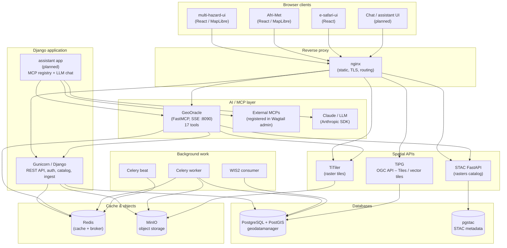

# Current architecture

This document describes the **as-deployed** architecture of the GeoDataManager stack (backend repo: geomgr / “data infrastructure”) and how **e-safari-ui** and **Afri-Met** consume it.

## High-level diagram



Service names match `docker-compose.yml`. Dashed nodes (CHAT, ASS) are planned but not yet implemented.

## GeoOracle MCP server

GeoOracle (`mcp/`) is a FastMCP 3.x server running inside Docker on port 8090, exposed via nginx at `/mcp/sse`. It acts as a bridge between LLM clients and the data stack — tools call internal HTTP APIs, no direct DB access.

**Tool routing:**

```
LLM tool call
  → GeoOracle (SSE)
      ├── catalog tools    → Django /api/catalog/
      ├── stac tools       → STAC FastAPI /search /collections
      ├── station tools    → Django /api/stations/
      ├── observation tools→ Django /api/observations/
      ├── country tools    → Django /api/stations/country-bounds/
      └── zonal stats      → Django boundary + STAC search + TiTiler /cog/statistics
                             └── Redis cache (24h TTL per country/dataset/date)
```

**Transports:**
- `MCP_TRANSPORT=sse` (default in docker-compose) — persistent HTTP server, accessible via nginx
- `MCP_TRANSPORT=stdio` — spawned on demand for local Claude Code use (`docker compose run --rm -T --no-deps -e MCP_TRANSPORT=stdio mcp`)

## Responsibility split

### GeoDataManager (this repository)

| Concern | Implementation |
|--------|----------------|
| Business logic, CRUD, permissions | Django apps (`catalog`, `stations`, `observations`, `ingest`, …) |
| Heavy or transactional APIs | Django REST Framework |
| Layer config, legend, styling | Wagtail snippets (`GeoServerLayer`, `StaticWmsLayer`, `Layer`) |
| Async ingestion and jobs | Celery + Redis |
| User uploads and derivatives | MinIO + media/static volumes |
| Vector tiles at scale | **TiPG** reading PostGIS |
| Raster catalog | pgstac + STAC FastAPI + TiTiler |
| MCP / AI tools | **GeoOracle** (`mcp/`) — 17 tools over SSE |
| AI chat endpoint + MCP registry | `assistant/` app *(planned)* — LLM provider + external MCP registration in Wagtail admin |

### Afri-Met (`afri-met/`)

| Concern | Pattern |
|--------|---------|
| Station map | **TiPG-first**: vector tiles with `filter=` on collection items (e.g. country code, `has_observations`) |
| Country context | Lightweight JSON (e.g. country bounds); client-side selection |
| Station statistics | **On demand** after user interaction; responses cacheable server-side |

This avoids loading full station aggregates on initial page load and keeps the map interactive.

### e-safari-ui (`e-safari-ui/`)

Shared UI components and patterns for ACMAD web products; may be deployed or linked alongside Afri-Met depending on routing. It consumes the same nginx/Django/TiPG stack where integrated.

## Data-flow principles (current)

1. **Maps**: Prefer **tiles** (TiPG) over bulk station list APIs for drawing points.
2. **Details**: Fetch **per-station** or **aggregated stats** only when needed (e.g. panel open, click).
3. **Caching**: Expensive read endpoints (e.g. time-series statistics) use short TTL caching where implemented.
4. **Single source of truth**: PostgreSQL/PostGIS; APIs and TiPG project views of the same data, not duplicate “live” datasets.

## Wagtail layer styling (admin)

Raster **Layer** snippets expose **Color stops** under *Raster styling*:

- Click the **swatch** to open the browser color picker, or type a **`#RRGGBB`** code directly (QGIS-style dual control).
- Import **QML** (QGIS singleband pseudocolor) or **SLD** (GeoServer ColorMap) to populate stops; edit colors manually afterward.
- Saved stops sync into `tile_params` for TiTiler unless *advanced tile params* is enabled.
- **Band** scheme auto-fills `tile_params` with `{"scheme": "band", "band_visualization_params": "bidx=1&bidx=2&bidx=3"}` (RGB) when empty; edit the fragment for other band combos or add `rescale` in extras.

The **Legend** field uses the same picker pattern as rows of **label → color** (e.g. `{"Low": "#d73027", "High": "#1a9850"}`), which matches how **e-safari-ui** renders legends (`renderLegend`). Structured legends (continuous ramps with `type` / `breaks` / `colors` arrays) still edit via the collapsed **Advanced JSON** section.

## Related files

- `docker-compose.yml` — service topology
- `nginx/` — how paths are routed to Django, static sites, TiPG, STAC, TiTiler
- `afri-met/README.md` — frontend-specific notes
- `e-safari-ui/README.md` — UI kit notes

---

*Last updated to reflect the TiPG-first map + lazy API pattern and composed Docker stack.*
