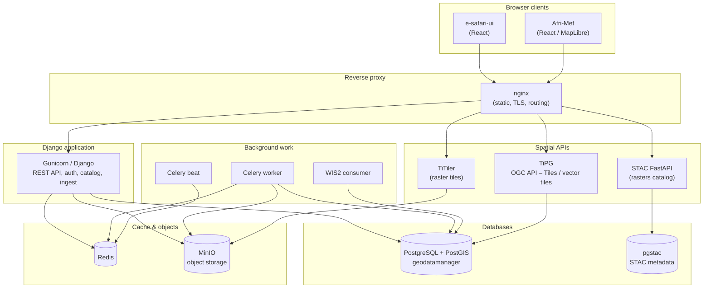

# Current architecture

This document describes the **as-deployed** architecture of the GeoDataManager stack (backend repo: geomgr / “data infrastructure”) and how **e-safari-ui** and **Afri-Met** consume it.

## High-level diagram

Service names match `docker-compose.yml` (`web`, `nginx`, `tipg`, `db`, `redis`, `minio`, `worker`, `stac_api`, `titiler`, `pgstac`, etc.). Exact URLs and paths depend on environment (see nginx configuration and `.env`).

## Responsibility split

### GeoDataManager (this repository)

| Concern | Implementation |
|--------|----------------|
| Business logic, CRUD, permissions | Django apps (`catalog`, `stations`, `observations`, `ingest`, …) |
| Heavy or transactional APIs | Django REST Framework |
| Async ingestion and jobs | Celery + Redis |
| User uploads and derivatives | MinIO + media/static volumes |
| Vector tiles at scale | **TiPG** reading PostGIS (e.g. published collections in configured schema) |
| Raster / STAC (where enabled) | pgstac + STAC FastAPI + TiTiler |

### Afri-Met (`afri-met/`)

| Concern | Pattern |
|--------|---------|
| Station map | **TiPG-first**: vector tiles with `filter=` on collection items (e.g. country code, `has_observations`) |
| Country context | Lightweight JSON (e.g. country bounds); client-side selection |
| Station statistics | **On demand** after user interaction; responses cacheable server-side |

This avoids loading full station aggregates on initial page load and keeps the map interactive.

### e-safari-ui (`e-safari-ui/`)

Shared UI components and patterns for ACMAD web products; may be deployed or linked alongside Afri-Met depending on routing. It consumes the same nginx/Django/TiPG stack where integrated.

## Data-flow principles (current)

1. **Maps**: Prefer **tiles** (TiPG) over bulk station list APIs for drawing points.
2. **Details**: Fetch **per-station** or **aggregated stats** only when needed (e.g. panel open, click).
3. **Caching**: Expensive read endpoints (e.g. time-series statistics) use short TTL caching where implemented.
4. **Single source of truth**: PostgreSQL/PostGIS; APIs and TiPG project views of the same data, not duplicate “live” datasets.

## Related files

- `docker-compose.yml` — service topology
- `nginx/` — how paths are routed to Django, static sites, TiPG, STAC, TiTiler
- `afri-met/README.md` — frontend-specific notes
- `e-safari-ui/README.md` — UI kit notes

---

*Last updated to reflect the TiPG-first map + lazy API pattern and composed Docker stack.*
