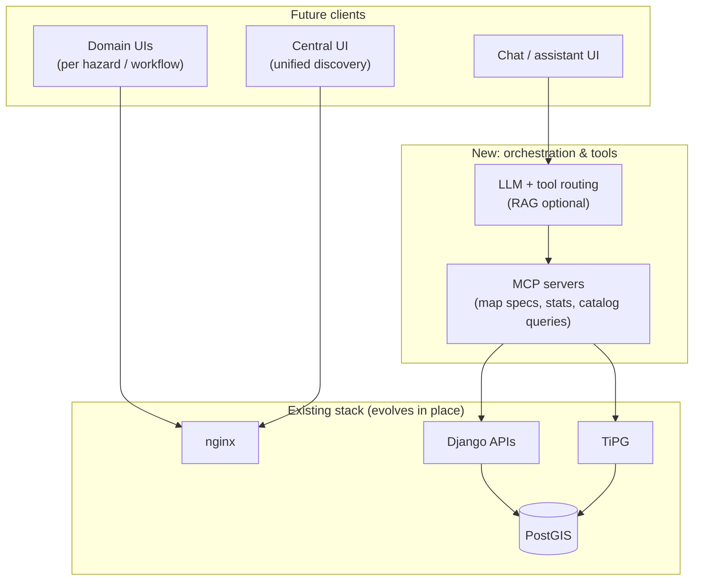

# Roadmap: multi-hazard platform and intelligence layer

This document outlines the **intended evolution** of the platform: from today’s **GeoDataManager + Afri-Met + e-safari-ui** toward a **multi-hazard** offering with a **central UI**, **MCP-backed tooling** for maps and statistics, and a **general-purpose LLM assistant** grounded in the same data and APIs.

It is a planning document; delivery order and timelines are subject to product priorities.

## Vision

- **One data infrastructure** (PostGIS, catalog, tiles, optional STAC/rasters) powers **multiple hazard domains** (meteorology, hydrology, drought, flood, …) without duplicating core storage per product.
- **Domain UIs**: focused experiences per hazard or workflow (separate pages or apps), reusing shared components (e.g. e-safari-ui patterns).
- **Central UI**: a cross-cutting entry point to discover layers, stations, products, and links into domain tools.
- **Assistant**: users ask natural-language questions; an **LLM** orchestrates **tools** (via **MCP**) that call **your** HTTP APIs and tile services so answers stay tied to real data.

## Target architecture (conceptual)

## Roadmap themes

### 1. Multi-hazard data model and APIs

- **Shared identifiers** and metadata for datasets, layers, and stations across domains.
- **Consistent API patterns**: list/detail/stats/tiles; document contracts in OpenAPI.
- **Optional materialized views or flags** (as with `has_observations`) to keep **tile filters** and dashboards fast without heavy ad hoc joins at request time.

### 2. Domain pages and central UI

- **Domain pages**: each hazard or project ships as a routed experience (path or subdomain), still backed by the same nginx/Django/TiPG core.
- **Central UI**: inventory of what exists (layers, stations, products), search/filter, deep links into Afri-Met-like maps or other viewers.
- **Design system alignment**: reuse e-safari-ui tokens and components for a coherent look.

### 3. MCP for maps and statistics

- **MCP servers** expose **tools** such as:
  - Build or refine **map definitions** (layers, filters, bbox, styles) consumed by MapLibre or server-side renderers.
  - Run **aggregations** or **time-series** via existing Django endpoints (with auth and rate limits).
  - Query **catalog** or **STAC** where relevant.
- **Principle**: MCP does not replace PostGIS; it **orchestrates calls** into services you already operate.

### 4. LLM chatbot (generalised Q&A)

- **Tool-calling** LLM uses MCP tools to retrieve facts; **no hallucinated numbers** for quantitative answers unless clearly labeled as estimates.
- Optional **RAG** over curated docs (methodology, glossary) separate from live numeric queries.
- **Same auth boundary** as the web app (tokens, roles) when tools hit Django.

### 5. Operations and quality

- **CI**: extend automated checks (frontend build, compose smoke, tests) as the surface area grows.
- **Observability**: trace slow queries, tile cache behaviour, and assistant tool latency.

## Near-term vs longer-term

| Horizon | Focus |
|--------|--------|
| **Near term** | Harden TiPG + Django split (tiles vs stats), expand metadata for cross-domain discovery, document public APIs. |
| **Medium term** | Central UI MVP; second domain pilot sharing the same stack. |
| **Longer term** | MCP tool suite + assistant behind the same auth and data policies. |

## Dependencies and risks

- **Consistency**: central UI and assistants require **stable catalog** and naming conventions.
- **Security**: LLM + MCP must respect **authorization** on every tool call.
- **Cost/latency**: LLM and repeated stats calls may need **caching** and **quotas**.

---

*This roadmap complements [Architecture](architecture.md). Update both when major milestones land.*
