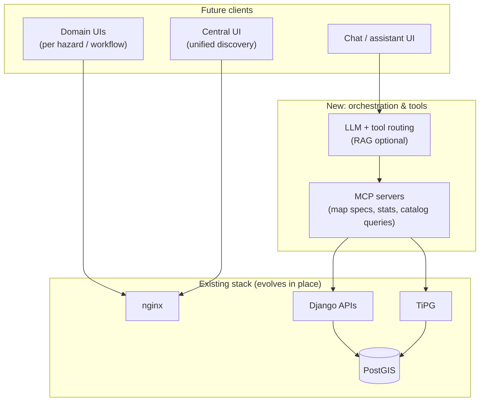

# Roadmap: multi-hazard platform and intelligence layer

This document outlines the **intended evolution** of the platform: from today’s **GeoDataManager + Afri-Met + e-safari-ui** toward a **multi-hazard** offering with a **central UI**, **MCP-backed tooling** for maps and statistics, and a **general-purpose LLM assistant** grounded in the same data and APIs.

It is a planning document; delivery order and timelines are subject to product priorities.

## Vision

- **One data infrastructure** (PostGIS, catalog, tiles, optional STAC/rasters) powers **multiple hazard domains** (meteorology, hydrology, drought, flood, …) without duplicating core storage per product.
- **Domain UIs**: focused experiences per hazard or workflow (separate pages or apps), reusing shared components (e.g. e-safari-ui patterns).
- **Central UI**: a cross-cutting entry point to discover layers, stations, products, and links into domain tools.
- **Assistant**: users ask natural-language questions; an **LLM** orchestrates **tools** (via **MCP**) that call **your** HTTP APIs and tile services so answers stay tied to real data.

## Target architecture (conceptual)



## Roadmap themes

### 1. Multi-hazard data model and APIs

- **Shared identifiers** and metadata for datasets, layers, and stations across domains.
- **Consistent API patterns**: list/detail/stats/tiles; document contracts in OpenAPI.
- **Optional materialized views or flags** (as with `has_observations`) to keep **tile filters** and dashboards fast without heavy ad hoc joins at request time.

### 2. Domain pages and central UI

- **Domain pages**: each hazard or project ships as a routed experience (path or subdomain), still backed by the same nginx/Django/TiPG core.
- **Central UI**: inventory of what exists (layers, stations, products), search/filter, deep links into Afri-Met-like maps or other viewers.
- **Design system alignment**: reuse e-safari-ui tokens and components for a coherent look.

### 3. MCP for maps and statistics — **IN PROGRESS**

**GeoOracle** is implemented and deployed. Current state:

- ✅ 17 tools across catalog, STAC, stations, observations, country resolution, zonal statistics
- ✅ SSE transport, accessible via nginx at `/mcp/sse` on all domains
- ✅ Country-level zonal stats chain: Django boundary → STAC search → TiTiler `/cog/statistics`
- ✅ Redis cache (24h TTL) for zonal stat results
- ✅ `.mcp.json` for Claude Code integration (local stdio + remote SSE)
- 🔲 MCP resources (`geomgr://countries`, `geomgr://collections`, `geomgr://hazard-categories`)
- 🔲 MCP prompt templates (`analyze_country_hazard`, `station_summary`)

### 4. LLM chatbot (generalised Q&A) — **PLANNED**

Design is complete; implementation is the next milestone. Architecture:

```
POST /api/assistant/chat/   (new Django assistant app)
  ↓
Load LLMProvider from DB (Wagtail admin → Snippets → LLM providers)
  ↓
Load active MCPServers from DB (Wagtail admin → Snippets → MCP servers)
  ↓
Connect to each MCP server → list tools → agentic loop with Claude
  ↓
Return grounded text response
```

Key design decisions already made:
- **External MCP registry in Wagtail admin**: add any MCP server (URL + optional auth token) without code changes — the assistant picks it up on the next request
- **LLM provider config in Wagtail admin**: switch between Claude models or providers without redeploy
- **Tool name prefixing**: `geooracle__resolve_country`, `weather__get_forecast` — avoids collisions across servers
- **No hallucinated numbers**: every quantitative claim is backed by a real tool call

Requires: `anthropic>=0.40`, `mcp>=1.0` added to `requirements.txt`.

### 5. Operations and quality

- **CI**: extend automated checks (frontend build, compose smoke, tests) as the surface area grows.
- **Observability**: trace slow queries, tile cache behaviour, and assistant tool latency.

## Near-term vs longer-term

| Horizon | Status | Focus |
|--------|--------|-------|
| **Near term** | ✅ Done | Multi-hazard UI, GeoOracle MCP, StaticWmsLayer, zonal stats |
| **Medium term** | 🔲 Next | `assistant` app — LLM chat endpoint + MCP registry in Wagtail admin |
| **Longer term** | 🔲 Future | RAG over methodology docs, streaming chat, auth-scoped tool access, Central UI |

## Dependencies and risks

- **Consistency**: central UI and assistants require **stable catalog** and naming conventions.
- **Security**: LLM + MCP must respect **authorization** on every tool call.
- **Cost/latency**: LLM and repeated stats calls may need **caching** and **quotas**.

---

*This roadmap complements [Architecture](architecture.md). Update both when major milestones land.*
